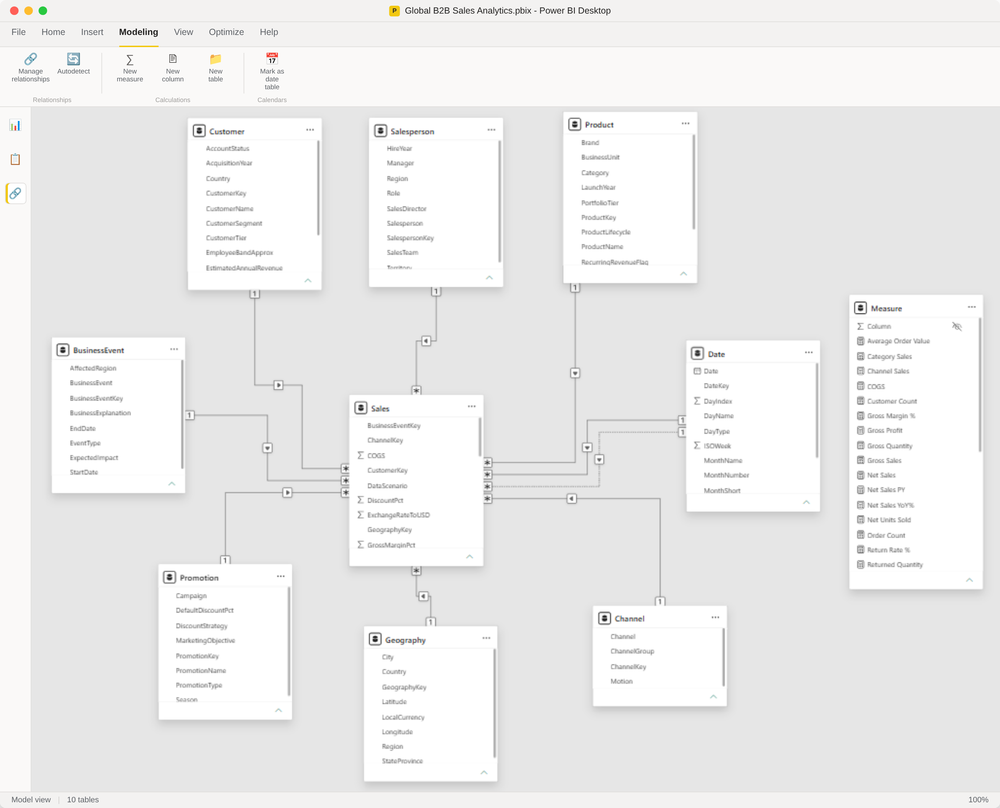
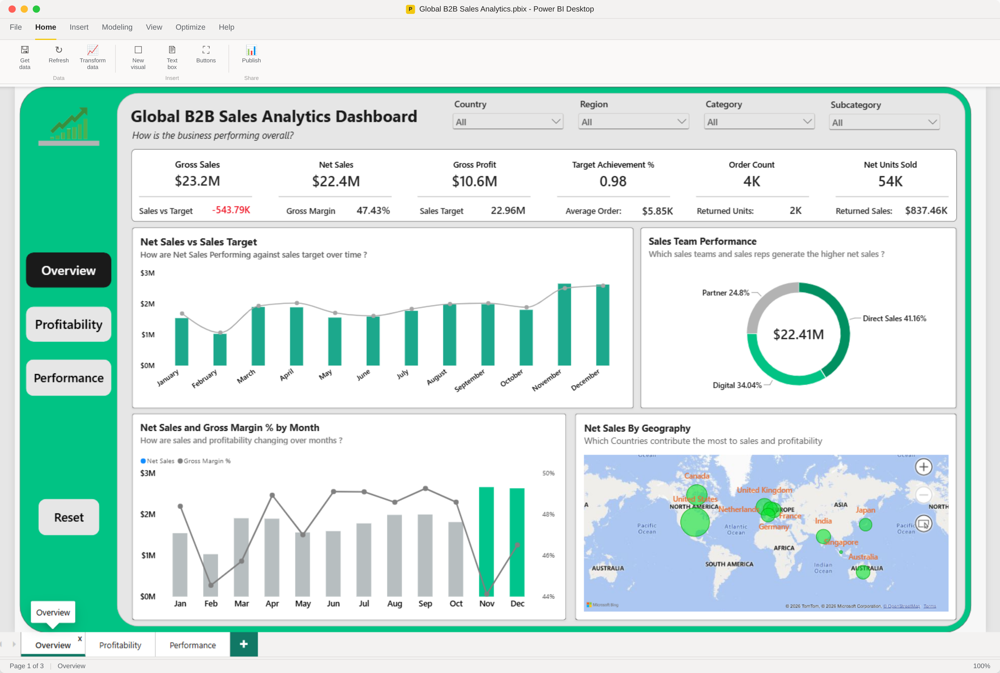
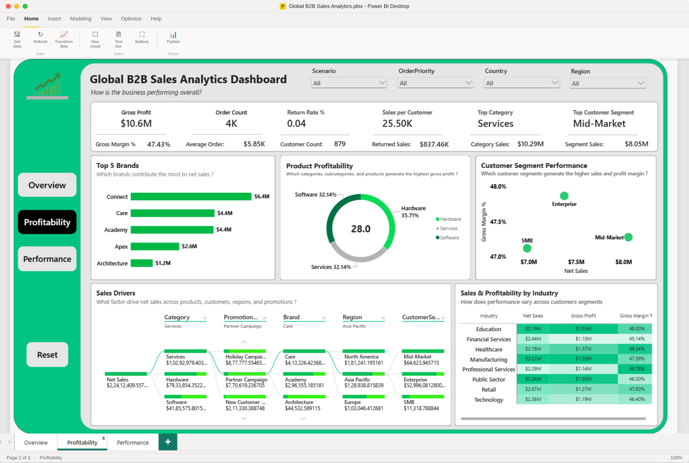
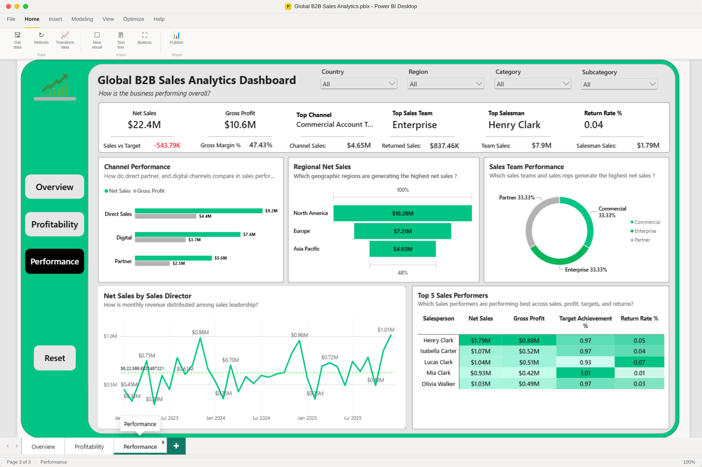

# Global B2B Sales Analytics – Power BI

## Project Overview

An interactive Power BI analytics solution built on 6,000 B2B sales transactions covering 2023–2025 across North America, Europe, and Asia Pacific. The dashboard tracks $22.4M in net sales and enables commercial leadership, regional heads, and finance directors to monitor revenue, profitability, target achievement, customer and product dynamics, channel effectiveness, return rates, and core business drivers.

---

## Business Problem

Executive leadership and commercial managers often lack a single consolidated platform to evaluate global B2B revenue performance. Key operational questions go unanswered:

* Are sales tracking against global and regional revenue targets?
* Which markets and geographic regions generate top-line growth versus bottom-line margin?
* Which product lines and customer tiers yield the highest profitability versus highest return risks?
* Which go-to-market channels, sales teams, and reps drive the largest share of revenue?
* Where do returns and operational events erode net sales?

Without a unified data solution, cross-regional comparisons remain siloed, delaying corrective actions and strategic adjustments.

---

## Business Objectives

* **Monitor Revenue & Margins:** Track gross and net sales alongside gross margin percentages across all operating markets.
* **Track Target Achievement:** Measure actual commercial delivery against set sales targets ($23M target vs. $22.4M actual, ~98% achievement).
* **Identify High-Value Segments:** Drill into customer segments, industries, and product categories to detect margin and revenue drivers.
* **Evaluate Go-to-Market Channels & Teams:** Analyze Direct, Digital, and Partner channels, as well as team and salesperson performance.
* **Assess Operational Quality & Returns:** Measure return rates across product lines, customer tiers, and sales territories.
* **Deconstruct Sales Drivers:** Utilize interactive root-cause and decomposition visuals to evaluate promotions, brands, and segments.

---

## Dataset & Data Model

The data architecture is structured as a **Star Schema**, ensuring fast DAX query performance and straightforward relationship management:

* **Fact Table:** `Sales` — 6,000 transaction lines with quantities, list/net pricing, discounts, COGS, gross profit, returns, shipping cost, exchange rates, and target amounts.
* **Dimension Tables:** `Customer` (900 accounts), `Salesperson` (36 reps), `Product` (28 SKUs), `Geography` (44 markets), `Channel`, `Promotion`, `BusinessEvent`, `Date` (2023–2026 calendar).
* **Dedicated Measure Table:** `Measure` — a centralized home for all DAX calculations, kept separate from the physical tables for a clean, maintainable model.
* **Relationships:** Single-direction, 1:M relationships from each dimension into `Sales`, keyed on `CustomerKey`, `ProductKey`, `SalespersonKey`, `GeographyKey`, `ChannelKey`, `PromotionKey`, `BusinessEventKey`, and `DateKey` — chosen for predictable filter propagation and fast query performance.
* **Data Refresh:** Sourced from a Microsoft Excel data file, transformed in Power Query, and loaded via Import mode. Scheduled Power BI Service refresh is planned (see *Future Improvements*).



---

## Dashboard Preview

### 1. Executive Overview
> **Focus Question:** *How is the business performing overall?*



* **Summary KPIs:** $22.4M Net Sales (-$544K vs. Target), $10.6M Gross Profit (47.43% Margin), 98% Target Achievement, 4K Orders, 54K Net Units, and a ~3.6% Return Rate ($837K returned).
* **Net Sales vs Sales Target:** Monthly and quarterly pacing against revenue targets across 2023–2025.
* **Net Sales by Channel Group:** Direct Sales accounts for 41.16%, Digital for 34.04%, and Partner channels for 24.80%.
* **Geographic Distribution:** Interactive geographic breakdown highlighting North America (~$10.2M aggregate across regions), Europe (~$7.2M), and APAC hubs (~$2.1M, $1.5M, $1.3M).

---

### 2. Profitability
> **Focus Question:** *Which customers and products drive business profitability?*



* **Top Product Categories:** Services generates the largest share of net sales, with Hardware and Software close behind, giving a balanced category mix.
* **Customer Segment Performance:** Scatter analysis contrasting Net Sales against Gross Margin % across Enterprise, Mid-Market, and SMB segments.
* **Sales Drivers Decomposition:** Root-cause hierarchy isolating sales from Category → Promotion → Brand → Region → Customer Segment.
* **Industry Breakdown:** Margin table showing top margin categories such as Healthcare, Professional Services, and Education, each above 48% gross margin.

---

### 3. Performance
> **Focus Question:** *What operational factors influence business performance?*



* **Channel Delivery:** Direct Sales, Digital, and Partner channels compared side by side on Net Sales and Gross Profit contribution.
* **Regional Hierarchy:** North America ($10.28M), Europe ($7.21M), and Asia Pacific ($4.93M).
* **Sales Team Contribution:** Commercial, Enterprise, and Partner teams each contributing a near-even third of total net sales.
* **Rep Leaderboard:** Individual scorecard tracking Net Sales, Gross Profit, Target Achievement %, and Return Rate — led by Henry Clark at $1.79M Net Sales.

---

## Key DAX Measures

**1. Net Revenue Realization**
```dax
Net Sales = 
[Gross Sales] - [Returned Sales]
```
Calculates net recognized revenue after deducting returned merchandise values.

**2. Gross Margin Efficiency**
```dax
Gross Margin % = 
DIVIDE ( [Gross Profit], [Net Sales] )
```
Measures operational profitability relative to net realized sales.

**3. Quota & Target Achievement**
```dax
Target Achievement % = 
DIVIDE ( [Net Sales], [Sales Target] )
```
Tracks commercial quota realization against defined regional targets.

**4. Return Rate Monitoring**
```dax
Return Rate % = 
DIVIDE ( [Returned Sales], [Gross Sales] )
```
Identifies revenue leakage and product quality friction across categories.

**5. Time Intelligence (YoY Growth)**
```dax
Net Sales PY = 
CALCULATE ( [Net Sales], SAMEPERIODLASTYEAR ( DimDate[Date] ) )

Net Sales YoY % = 
DIVIDE ( [Net Sales] - [Net Sales PY], [Net Sales PY] )
```
Enables dynamic year-over-year revenue pacing and trajectory comparisons.

**Note:** The Measure table also includes supporting base and derived DAX measures — Gross Sales, Returned Sales, COGS, Gross Profit, Gross Quantity, Returned Quantity, Net Units Sold, Order Count, Average Order Value, Sales vs Target, and Sales vs Target % — all centralized in one dedicated table using safe division (`DIVIDE()`) to avoid divide-by-zero errors.

---

## Interactive Features

* **Multi-Level Drill-Down:** Product Category → Subcategory → Product; Sales Team → Individual Salesperson.
* **Cross-Filtering:** Interactive filtering across maps, customer/product visuals, channel analysis, and performance tables.
* **Custom Tooltips:** Detailed KPI information including Net Sales, Gross Profit, Gross Margin %, Return Rate %, Average Order Value, and Target Achievement %.
* **Dynamic Slicers:** Interactive filtering by Year, Region, Sales Team, Channel Group, Customer Segment, and Promotion.
* **Interactive Analysis:** Decomposition Tree for exploring Net Sales drivers across Category, Brand, Region, Customer Segment, and Promotion.

---

## Key Business Insights

* **Target Performance:** Identifies periods and regions where Net Sales are exceeding or falling below Sales Targets, highlighting the largest performance gaps.
* **Profitability:** Reveals which product categories, subcategories, brands, and customer segments generate the strongest Gross Profit and Gross Margin.
* **Customer Performance:** Highlights the customer segments and industries contributing the greatest Net Sales while identifying differences in profitability and return rates.
* **Channel Performance:** Compares Direct, Partner, and Digital channels to identify the strongest contributors to revenue and profitability.
* **Sales Team Performance:** Identifies high-performing sales teams and individual salespeople based on Net Sales, Gross Profit, Target Achievement %, and Return Rate.
* **Returns & Business Drivers:** Highlights product categories and regions most affected by returns while enabling analysis of promotions and business events associated with changes in sales performance.

---

## Tools & Technologies

- **Business Intelligence:** Power BI Desktop, ZoomCharts Visuals
- **Data Modeling & Calculations:** DAX, Power Query (M)
- **Architecture:** Star Schema Data Modeling
- **Data Source:** Microsoft Excel Data File
- **Version Control:** Git, GitHub

---

## Skills Demonstrated

- **Data Modeling:** Star schema design, relationship cardinality (1:M), and dimensional modeling across sales, customer, product, geography, channel, promotion, salesperson, and business-event dimensions.
- **DAX & Calculations:** Time intelligence, safe division with `DIVIDE()`, dynamic KPI calculations, target achievement, sales variance, profitability, and return metrics.
- **UI/UX & Data Storytelling:** Three-page analytical flow — Executive Overview → Profitability → Performance — with interactive drill-downs, slicers, tooltips, and business-focused visual hierarchy.
- **Commercial Analytics:** Target tracking, revenue and profitability analysis, customer and product performance, channel benchmarking, sales-team performance, and return analysis.

---

## Data Preparation

- Cleaned and transformed the source data using **Power Query**.
- Standardized and validated dimension and fact-table keys including `CustomerKey`, `ProductKey`, `SalespersonKey`, `GeographyKey`, `ChannelKey`, `PromotionKey`, and `BusinessEventKey`.
- Converted multi-currency transaction values to USD using the provided `ExchangeRateToUSD` field.
- Incorporated transaction returns into sales analysis using returned sales, return quantities, net sales, and net units sold measures.
- Prepared the data model to support time-based analysis from **2023 to 2025**.

---

## How to Use

1. Clone or download this repository.
2. Ensure you have the latest compatible version of **Power BI Desktop** installed.
3. Open `B2B_Sales_Analytics_Dashboard.pbix`.
4. Use the report navigation to move between **Executive Overview**, **Profitability**, and **Performance**.
5. Use the available slicers to filter the analysis by dimensions such as **Year, Region, Sales Team, Channel Group, Customer Segment, and Promotion**.
6. Use the drill-down visuals to move from **Category → Subcategory → Product** and **Sales Team → Salesperson**.

---

## Limitations

- **Simulated Data:** The dataset contains simulated B2B sales transactions and should not be interpreted as real company performance.
- **Event Analysis:** Business events and promotions are analyzed in relation to sales performance; the dashboard does not establish direct causal relationships.
- **Exchange Rates:** Multi-currency analysis depends on the exchange rates provided in the dataset.
- **Historical Analysis:** The report analyzes the available 2023–2025 period and does not represent a predictive forecast unless additional forecasting functionality is added.

## Future Improvements

- Integrate automated Power BI Service scheduled refresh workflows.
- Implement **Row-Level Security (RLS)** for territories, sales teams, and account managers.
- Add predictive forecasting for future revenue and target performance.
- Introduce deeper customer churn, cohort, and retention analysis.
- Expand promotion and business-event analysis with more formal statistical or causal-effect evaluation.

## Author

**Mirzan**

- **LinkedIn:** [linkedin.com/in/mirzan-fawas](https://www.linkedin.com/in/mirzan-fawas)
- **GitHub:** [github.com/mhdmirzan](https://github.com/mhdmirzan)
- **Portfolio:** [mirzan.dev](https://mirzan.dev)

---

## ⭐ Support & Connect

If you found this project useful, consider starring the repository ⭐ — it helps support my work and encourages me to build more data analytics projects.

I'm always open to collaborations, feedback, and new projects. If you'd like to work together on a Power BI, data analytics, or business intelligence project, feel free to connect with me on LinkedIn or reach out through GitHub.

**Let's build something meaningful with data.**
